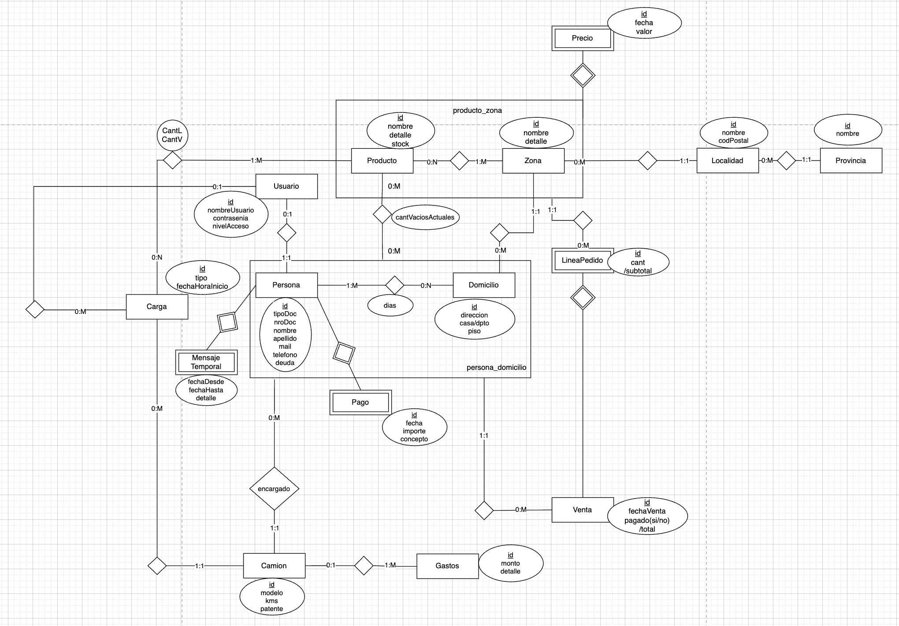

# TP-Java

## Descripción

Software para venta y distribución de bebidas con seguimiento de envases vacíos para los retornables. Garantiza la honestidad de los choferes controlando lo que se lleva y lo que se trae, contrastándolo con las ventas que hizo. Cuenta con una plataforma para los choferes, ayudándolos a recordar todos los puntos en donde tienen que vender y registrando la venta. Además, cuenta con una plataforma para los clientes donde pueden ver su deuda y el detalle de la misma, así como enlaces para cancelarla automáticamente.

Además del control de los choferes para ayudar a la administración, cuenta con un registro de gastos para los vehículos de la empresa sumado a un dashboard repleto de información de las ventas y las deudas
## Enlace al Frontend y Backend

## DER

##### Regularidad

| Requerimiento    | Detalle/Listado de casos incluidos                                                                     |
| :--------------- | ------------------------------------------------------------------------------------------------------ |
| ABMC simple      | Producto  Zona  Usuario   Persona   Camion                                                 |
| ABMC dependiente | Domicilio                                                        |
| CU NO-ABMC       | Venta   Carga/Descarga                                                                              |
| Listado simple   | Listado de Clientes (Por zona, deudores, etc).   Listado de camiones (por ventas, zona, dia, etc.). |
| Listado complejo | Listado de ventas (filtado por montos, zona, producto, etc. )                                          |

##### Aprobación Directa                                                                                                                                                                                      |
| Requerimiento                   | Detalle/Listado de casos incluidos                                                                                                                                                      |
| :------------------------------ | :-------------------------------------------------------------------------------------------------------------------------------------------------------------------------------------- |
| ABMC                            |  Precio  Localidad  Provincia  Domicilio  LineaPedido  Venta  Mensaje  Temporal  Pago  Gastos                                                             |
| CU "Complejo"                   | Registro nuevo cliente/domicilio   Asignar clientes a camion   Asignar los precios a los productos por zona (Ent: Precio)    Mandar a los deudores la deuda (API: Wspp)        |
| Listado complejo                | Listado de ventas.                                                                                                                                                                   |
| Nivel de acceso                 | Cliente   Admin   Empleado   No registrado                                                                                                                                     |
| requerimiento extra obligatorio | N                                                                                                                                                                                       |

###### Requerimientos extra - AD

| Requerimiento      | Detalle/Listado de casos incluidos |
| :----------------- | :--------------------------------- |
| Manejo de archivos |                                    |
| Custom exceptions  |                                    |
| Log de errores     |                                    |
| Envio de emails    |                                    |
